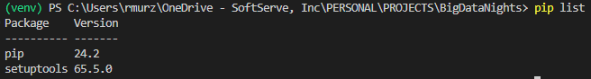
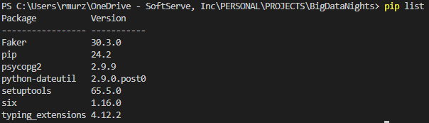

# BigDataNights

Repository to store case studies for **Big Data Nights** presentations.

## Content
- [Big Data Night #1: Cloud Data Engineering Toolstack with GCP](#)
- [Big Data Night #2: Synthetic Data in Action](night_2/README.md)
- [Big Data Night #3: To be announced](#)

## Big Data Nights description

#### [Big Data Night #1: Cloud Data Engineering Toolstack with GCP](https://www.softserveinc.com/en-us/events/big-data-nights-cloud-data-engineering)
The team will provide a quick run-through of the regular activities of a Data Engineer, position data engineering against the other data roles available and provide best practices coming both from Google and our Center of Excellence. We will deep dive into the most common GCP tools and technologies used in the projects and we will illustrate these with a demo. A relevant one, not New York taxi rides, movies or weather demos. The team will also cover the trainings available, including retraining and paths to getting into data engineering in no time.

#### [Big Data Night #2: Synthetic Data in Action](https://www.softserveinc.com/en-us/events/big-data-nights-2-synthetic-data-in-action)
Imagine solving real-world business problems with data you create yourself! In this hands-on proof of concept, you'll learn how to generate synthetic data using Python, simulating real-life scenarios to meet specific business needs. From there, you’ll dive into dbt models, transforming that raw data into meaningful insights to answer key business questions. Finally, with pgAdmin 4, you’ll get to explore and analyze the transformed data, seeing firsthand how it can drive decision-making.
This session is designed to give you practical experience from start to finish — creating, transforming, and analyzing data in a fully local environment. Whether you're new to synthetic data or looking to refine your skills, you'll leave with the tools to build scalable pipelines and apply them to real-world situations.

## Prepare work environment
If you want to follow on your own the presentation and implement the project on your local machine follow these intructions.

**Note:** All commands used in this repository are for Windows.\
In repository main directory `BigDataNights` create a virtual environment that will be used for this project.
```
python -m venv venv
.\venv\Scripts\activate
```

After activating the virtual environment, you have a clean environment that don't have libraries installed. You can check this using command below.
```
pip list
```


As the environment is clean, here are two main options to get all necessary dependecies. Install necessary libraries one by one and store them in `requirement.txt` file.
```
python.exe -m pip install --upgrade pip
pip install psycopg2
pip install faker
pip freeze > requirements.txt
```
Also, it can be installed from a existing `requirements.txt` file using command below.
```
pip install -r requirements.txt
```
The result of this operation is presented in the image below.

