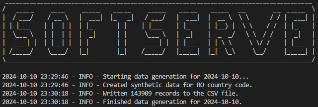
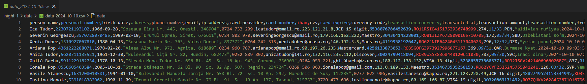
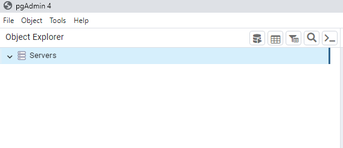

# Big Data Night #1 - Synthetic Data in Action: Proof of Concept in Real-World Scenarios

## Topic

## Scenario

## Implementation
This section present all practical stages from the project.

### Create local server
Install [pgAdmin 4](https://www.pgadmin.org/download/pgadmin-4-windows/) and opne it. Create a user and password.\
Once you have access to the *pgAdmin 4* you should see an interface as in image below.\

Right click on `Server`, choose `Register` and `Server...`. There will be opened a dialog-box as in image below. In *General* section complete in *Name* field the `BDN` value.

In *Connection* section complete *Host name/address* with value `localhost`, *Port* with `5432`, *Username* with `postgres`, and *Password* with your password.

Now you have the server *BDN* available with *default* database *postgres* as it was defined in server setup.\

### Create database infrastructure
