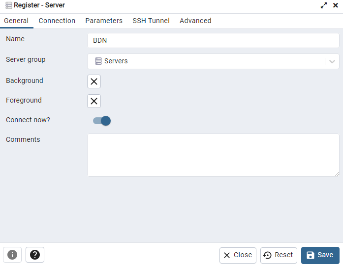

# Big Data Night #1 - Synthetic Data in Action: Proof of Concept in Real-World Scenarios

## Topic

## Scenario
person_name, personal_number, birth_date, address, phone_number, email, ip_address, card_provider, card_number, iban, cvv, card_expire, currency_code, transaction_currency, transacted_at, transaction_amount, transaction_number, from_country, to_country, record_id

## Implementation
This section present all practical stages from the project.\
According to *Scenario* section there should be created the **Proof of Concept** for client requirements.\
Stages for the **Proof of Concept**
* generated synthetic data.
* create local server.
* create dedicated database.
* create bronze schema.
* create table for raw data.
* extract raw data.
* create silver schema.
* transform data.
* create golden schema.
* load data.
* respond to the bussines questions.

### Generate Synthetic Data
In order to fulfill the requirement and simulate the real sensitive data it will be used a library named [Faker](https://faker.readthedocs.io/en/master/) that allow to generate necessary type of data.
Also, as the necessary target are from specific counttry - Romania, there will be another function that will handle this requirement.\
Create a directory named `src`, in this directory create a file named `data_generator.py`. In this file paste the code below for function that handle country specific data.
```
def create_data(locale: str) -> Faker:
    return Faker(locale)
```

To generate actual type of data create another function bu pasting code from below.
```
def generate_record(fake: Faker) -> list:
    person_name = fake.name()
    personal_number = fake.ssn()
    birth_date = fake.date_of_birth(None, 18, 70)
    address = fake.address().replace("\n", ", ")
    phone_number = fake.phone_number()
    email = person_name.replace(" ", "").lower()+"@"+fake.free_email_domain()
    ip_address = fake.ipv4()
    card_provider = fake.credit_card_provider()
    card_number = fake.credit_card_number() 
    iban = fake.iban()
    cvv = fake.credit_card_security_code()
    card_expire = fake.credit_card_expire()
    currency_code = fake.currency()[0]
    transaction_currency = fake.currency()[1]
    transacted_at = fake.date_time_between("-1d", "now")
    transaction_amount = random.randint(0, 1_000_000)
    transaction_number = fake.uuid4()
    from_country = fake.country()
    to_country = fake.country()
    record_id = fake.uuid4()
    return [
        person_name, personal_number, birth_date,
        address, phone_number, email, ip_address, card_provider,
        card_number, iban, cvv, card_expire, currency_code,
        transaction_currency, transacted_at, transaction_amount,
        transaction_number, from_country, to_country, record_id
    ]
```
Also, create a function that will generate necessary number of records at each call. For this function copy the code from below.
```
def write_to_csv(file_path: str) -> None:
    fake = create_data("ro_RO")
    headers = [
        "person_name", "personal_number", "birth_date",
        "address", "phone_number", "email", "ip_address", "card_provider",
        "card_number", "iban", "cvv", "card_expire", "currency_code",
        "transaction_currency", "transacted_at", "transaction_amount",
        "transaction_number", "from_country", "to_country", "record_id"
    ]
    with open(file_path, mode="w", encoding="utf-8", newline="") as file:
        writer = csv.writer(file)
        writer.writerow(headers)
        no_records = random.randint(101_101, 303_303)
        for _ in range(no_records):
            writer.writerow(generate_record(fake))
```

In order to generate data run the command from below.
```
python src/data_generator.py
```

The process of data generation will display in terminal the logs as shown in the image below.\


In `data` directory with the name `data_YYYY-MM-DD.csv` will available a file that contains generated data.


### Create Local Server
Install [pgAdmin 4](https://www.pgadmin.org/download/pgadmin-4-windows/) and open it. Create a user and password.\
Once you have access to the *pgAdmin 4* you should see an interface as in image below.\


Right click on `Server`, choose `Register` and `Server...`. There will be opened a dialog-box as in image below. In *General* section complete in *Name* field the `BDN` value.\


In *Connection* section complete *Host name/address* with value `localhost`, *Port* with `5432`, *Username* with `postgres`, and *Password* with your password.\


Now you have the server *BDN* available with *default* database *postgres* as it was defined in server setup.\


### Create dedicated database
In the server that was created is a default database created, but as per requirements there will be created dedicated database for the client project named `bdn_db`. Also, there will be created three diferent schemas for each environment: bronze, silver, and gold. Also, will be created relevant tables for data storage.\
Create a file that will store the credentials for database. Name this file `credentials.json` and paste the content from below by updating your credentials.
```
{
    "default_db": {
        "dbname": "postgres",
        "user": "postgres",
        "password": "password",
        "host": "localhost",
        "port": "5432"
    },
    "bdn_db": {
        "dbname": "bdn_db",
        "user": "postgres",
        "password": "password",
        "host": "localhost",
        "port": "5432"
    }
}
```

Create a file named `db_generator.py` where wil need to create functions that will handle the infrastructure generation: database, bronze schema, and table for raw data. The database is named `bdn_db`, the schema is named `bronze_layer`, and the table is named `raw_data`.\
For function that read the credentials from secret file paste the code below.
```
def read_credentials(file_path: str) -> dict:
    with open(file_path, 'r') as file:
        credentials = json.load(file)
    return credentials
```

For SQL query read create a function using the code below.
```
def read_sql(file_path: str) -> str:
    with open(file_path, 'r') as sql_file:
        sql_query = sql_file.read()
    return sql_query
```

To create a database build a function using the code below that will handle this functionality.
```
def create_db(conn: psycopg2.connect, db_name: str) -> None:
    conn.autocommit = True
    cur = conn.cursor()
    create_db_query = sql.SQL("CREATE DATABASE {}").format(sql.Identifier(db_name))
    cur.execute(create_db_query)
    cur.close()
    conn.close()
```

To connect to the database create a function using the code below that will handle this functionality.
```
def connect_db(credentials: dict) -> psycopg2.connect:
    conn = psycopg2.connect(
        dbname=credentials['dbname'],
        user=credentials['user'],
        password=credentials['password'],
        host=credentials['host'],
        port=credentials['port']
    )
    return conn
```

To create schema and table create a function by pasting the code below and also create a SQL query for each.
```
def create_object(conn: psycopg2.connect, creation_query: str) -> None:
    cur = conn.cursor()
    cur.execute(creation_query)
    conn.commit()
    cur.close()
    conn.close()
```

### Create bronze schema
To create schema and table create a function by pasting the code below and also create a SQL query for each.
```
def create_object(conn: psycopg2.connect, creation_query: str) -> None:
    cur = conn.cursor()
    cur.execute(creation_query)
    conn.commit()
    cur.close()
    conn.close()
```

To generate the schema create a file named `schema_query.sql` and paste the content from below.
```
CREATE SCHEMA IF NOT EXISTS bronze_layer;
```

### Create table for raw data
To generate the schema create a file named `schema_query.sql` and paste the content from below.
```
CREATE SCHEMA IF NOT EXISTS bronze_layer;
```

To generate the table create a file named `table_query.sql` and paste the content from below.
```
CREATE TABLE IF NOT EXISTS bronze_layer.raw_data (
    person_name VARCHAR(50)
    ,personal_number BIGINT
    ,birth_date DATE
    ,address VARCHAR(250)
    ,phone_number VARCHAR(25)
    ,email VARCHAR(50)
    ,ip_address VARCHAR(20)
    ,card_provider VARCHAR(50)
    ,card_number BIGINT
    ,iban VARCHAR(25)
    ,cvv INT
    ,card_expire VARCHAR(10)
    ,currency_code VARCHAR(10)
    ,transaction_currency VARCHAR(50)
    ,transacted_at TIMESTAMP
    ,transaction_amount INT
    ,transaction_number VARCHAR(50)
    ,from_country VARCHAR(50)
    ,to_country VARCHAR(50)
    ,record_id VARCHAR(50)
);
```

Run the command from below to generate the whole infrastructure.
```
python src/db_creator.py
```


Now in *pgAdmin 4* are available the server named `BDN`, the database named `bdn_db`, the schema named `bronze_layer`, and the table named `raw_data` with all 20 columns that were required.\


### Extract raw data
To load data to 


### Create silver schema


### Transform data
### Create golden schema
### Load data
### Respond to the bussines questions