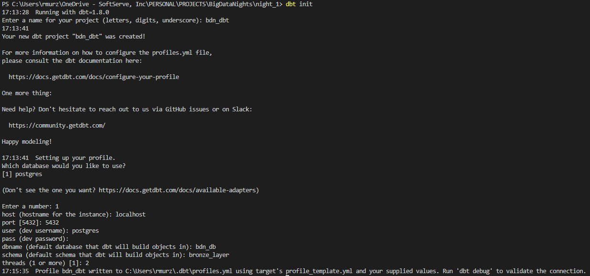
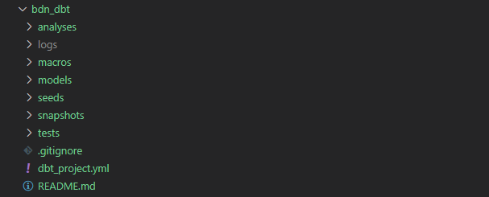

# Big Data Night #2 - Synthetic Data in Action: Proof of Concept in Real-World Scenarios

## Scenario
The client is *BigDataNight*, a romanian Start-Up company that provide a on-line banking for Information Technology start-ups from Romania.

The client want to develop Analytic department that involve **Analytics** for daily reporting, **Machine Learning** for frauds and crime detection, **Artificial Intelligence** for own banking application.

The client needs to have a dedicated server for their clients and transactions data. Also, needs to have a dedicated database and three different schema, one for each level of ETL: bronze, silver, and gold.\
As the client activity is in financial field, there are sensitive data that cannot be used in development phase. The requirement is to work with synthetic data for development phase.\
Data that are ingested daily varying from 101.101 to 303.303 transaction per day.\
Available schema of the client data is: *person_name, personal_number, birth_date, address, phone_number, email, ip_address, card_provider, card_number, iban, cvv, card_expire, currency_code, transaction_currency, transacted_at, transaction_amount, transaction_number, from_country, to_country, record_id*.\
As the client just started the activity, the system should be scalable and robust.

The requirements for **Proof of Concept** are: generated synthetic data for testing; create local server; create dedicated database; create all three schemas, create tables - one for raw zone, three for staging zone, and five for trusted zone; extract raw data in raz zone; transform data in staging zone; load data and split between PII and Non-PII data; create business views for five business requirements: *Average transaction amount for each country where transactions originated, rounded to two decimal places and ordered in descending order*, *Ranks card providers based on total transaction amount, returning the top 5 card providers*, *Calculates the total transaction amount grouped by transaction currency*, *Counts the number of transactions per person*, and *Details of transactions made in the last 30 days, including transaction number, date, amount, person name, and card number*.

## Implementation
This section present all practical stages from the project.\
According to *Scenario* section there should be created the **Proof of Concept** for client requirements.\
Stages for the **Proof of Concept:**
* generated synthetic data.
* create local server.
* create dedicated database.
* create schemas.
* create tables.
* extract raw data.
* transform data.
* load data.
* create business views.

### Generate Synthetic Data
In order to fulfill the requirement and simulate the real sensitive data it will be used a library named [Faker](https://faker.readthedocs.io/en/master/) that allow to generate necessary type of data.
Also, as the necessary target are from specific counttry - Romania, there will be another function that will handle this requirement.\
Create a directory named `src`, in this directory create a file named `data_generator.py`. In this file paste the code below for function that handle country specific data.
```
def create_data(locale: str) -> Faker:
    return Faker(locale)
```

To generate actual type of data create another function bu pasting code from below.
```
def generate_record(synthetic: Faker) -> list:
    person_name = synthetic.name()
    personal_number = synthetic.ssn()
    birth_date = synthetic.date_of_birth(None, 18, 70)
    address = synthetic.address().replace("\n", ", ")
    phone_number = synthetic.phone_number()
    email = person_name.replace(" ", "").lower()+"@"+synthetic.free_email_domain()
    ip_address = synthetic.ipv4()
    card_provider = synthetic.credit_card_provider()
    card_number = synthetic.credit_card_number() 
    iban = synthetic.iban()
    cvv = synthetic.credit_card_security_code()
    card_expire = synthetic.credit_card_expire()
    currency = synthetic.currency()
    currency_code = currency[0]
    transaction_currency = currency[1]
    transacted_at = synthetic.date_time_between("-1d", "now")
    transaction_amount = random.randint(0, 1_000_000)
    transaction_number = synthetic.uuid4()
    from_country = synthetic.country()
    to_country = synthetic.country()
    record_id = synthetic.uuid4()
    return [
        person_name, personal_number, birth_date,
        address, phone_number, email, ip_address, card_provider,
        card_number, iban, cvv, card_expire, currency_code,
        transaction_currency, transacted_at, transaction_amount,
        transaction_number, from_country, to_country, record_id
    ]
```
Also, create a function that will generate necessary number of records at each call. For this function copy the code from below.
```
def write_to_csv(file_path: str) -> None:
    synthetic = create_data("ro_RO")
    headers = [
        "person_name", "personal_number", "birth_date",
        "address", "phone_number", "email", "ip_address", "card_provider",
        "card_number", "iban", "cvv", "card_expire", "currency_code",
        "transaction_currency", "transacted_at", "transaction_amount",
        "transaction_number", "from_country", "to_country", "record_id"
    ]
    with open(file_path, mode="w", encoding="utf-8", newline="") as file:
        writer = csv.writer(file)
        writer.writerow(headers)
        no_records = random.randint(101_101, 303_303)
        for _ in range(no_records):
            writer.writerow(generate_record(synthetic))
```

In order to generate data run the command from below.
```
python src/data_generator.py
```

The process of data generation will display in terminal the logs as shown in the image below.\


In `data` directory with the name `data_YYYY-MM-DD.csv` will available a file that contains generated data.


### Create Local Server
Install [pgAdmin 4](https://www.pgadmin.org/download/pgadmin-4-windows/) and open it. Create a user and password.\
Once you have access to the *pgAdmin 4* you should see an interface as in image below.\


Right click on `Server`, choose `Register` and `Server...`. There will be opened a dialog-box as in image below. In *General* section complete in *Name* field the `BDN` value.\


In *Connection* section complete *Host name/address* with value `localhost`, *Port* with `5432`, *Username* with `postgres`, and *Password* with your password.\


Now you have the server *BDN* available with *default* database *postgres* as it was defined in server setup.\


### Create dedicated database
In the server that was created is a default database created, but as per requirements there will be created dedicated database for the client project named `bdn_db`. Also, there will be created three diferent schemas for each environment: bronze, silver, and gold. Also, will be created relevant tables for data storage.\
Create a file that will store the credentials for database. Name this file `credentials.json` and paste the content from below by updating your credentials.
```
{
    "default_db": {
        "dbname": "postgres",
        "user": "postgres",
        "password": "password",
        "host": "localhost",
        "port": "5432"
    },
    "bdn_db": {
        "dbname": "bdn_db",
        "user": "postgres",
        "password": "password",
        "host": "localhost",
        "port": "5432"
    }
}
```

Create a file named `db_generator.py` where wil need to create functions that will handle the infrastructure generation: database, bronze schema, and table for raw data. The database is named `bdn_db`, the schema is named `bronze_layer`, and the table is named `raw_data`.\
For function that read the credentials from secret file paste the code below.
```
def read_credentials(file_path: str) -> dict:
    with open(file_path, 'r') as file:
        credentials = json.load(file)
    return credentials
```

For SQL query read create a function using the code below.
```
def read_sql(file_path: str) -> str:
    with open(file_path, 'r') as sql_file:
        sql_query = sql_file.read()
    return sql_query
```

To create a database build a function using the code below that will handle this functionality.
```
def create_db(conn: psycopg2.connect, db_name: str) -> None:
    conn.autocommit = True
    cursor = conn.cursor()
    create_db_query = sql.SQL("CREATE DATABASE {}").format(sql.Identifier(db_name))
    cursor.execute(create_db_query)
    cursor.close()
    conn.close()
```

To connect to the database create a function using the code below that will handle this functionality.
```
def connect_db(credentials: dict) -> psycopg2.connect:
    conn = psycopg2.connect(
        dbname=credentials['dbname'],
        user=credentials['user'],
        password=credentials['password'],
        host=credentials['host'],
        port=credentials['port']
    )
    return conn
```

To create schema and table create a function by pasting the code below and also create a SQL query for each.
```
def create_object(conn: psycopg2.connect, creation_query: str) -> None:
    cursor = conn.cursor()
    cursor.execute(creation_query)
    conn.commit()
    cursor.close()
    conn.close()
```

### Create bronze schema
To create schema and table create a function by pasting the code below and also create a SQL query for each.
```
def create_object(conn: psycopg2.connect, creation_query: str) -> None:
    cursor = conn.cursor()
    cursor.execute(creation_query)
    conn.commit()
    cursor.close()
    conn.close()
```

To generate the schema create a file named `schema_query.sql` and paste the content from below.
```
CREATE SCHEMA IF NOT EXISTS bronze_layer;
```

### Create table for raw data
To generate the schema create a file named `schema_query.sql` and paste the content from below.
```
CREATE SCHEMA IF NOT EXISTS bronze_layer;
```

To generate the table create a file named `table_query.sql` and paste the content from below.
```
CREATE TABLE IF NOT EXISTS bronze_layer.raw_data (
    person_name VARCHAR(50)
    ,personal_number BIGINT
    ,birth_date DATE
    ,address VARCHAR(250)
    ,phone_number VARCHAR(25)
    ,email VARCHAR(50)
    ,ip_address VARCHAR(20)
    ,card_provider VARCHAR(50)
    ,card_number BIGINT
    ,iban VARCHAR(25)
    ,cvv INT
    ,card_expire VARCHAR(10)
    ,currency_code VARCHAR(10)
    ,transaction_currency VARCHAR(50)
    ,transacted_at TIMESTAMP
    ,transaction_amount INT
    ,transaction_number VARCHAR(50)
    ,from_country VARCHAR(50)
    ,to_country VARCHAR(50)
    ,record_id VARCHAR(50)
);
```

Run the command from below to generate the whole infrastructure.
```
python src/db_creator.py
```


Now in *pgAdmin 4* are available the server named `BDN`, the database named `bdn_db`, the schema named `bronze_layer`, and the table named `raw_data` with all 20 columns that were required.\


### Extract raw data
To load data to the database c.\
Create a file named `data_loader.py` where wil need to create a function that will load data to the *bronze_layer* schema, *raw_data* table. For this function use the code below.
```
def load_data(conn, file_path) -> None:
    cursor = conn.cursor()
    with open(file_path, 'r', encoding='utf-8') as file:
        next(file)
        cursor.copy_expert(f"""
            COPY bronze_layer.raw_data(person_name, personal_number, birth_date, address, phone_number, email,
                        ip_address, card_provider, card_number, iban, cvv, card_expire, currency_code, transaction_currency,
                        transacted_at, transaction_amount, transaction_number, from_country, to_country, record_id)
            FROM STDIN
            WITH CSV HEADER DELIMITER ',' QUOTE '"'
        """, file) 
    conn.commit()
    cursor.close()
    conn.close()
```

Run the command from below to generate the whole infrastructure.
```
python src/data_loader.py
```


In the *pgAdmin 4* run the query from below to see the data in the database.
```
SELECT
    *
FROM
    bronze_layer.raw_data
LIMIT
    10
```


### Create silver schema

#### Prepare dbt
Navigate to `C:\Users\<user>` and create a directory named `.dbt`. In the directory *.dbt* will be stored the configuration file for *dbt* project that will be generated automatically after setup the *dbt*. For now, the directory should be empty.\


In terminal navigate to `night_1` directory using command below. This command will initialize a *dbt* project in selected directory.
```
cd night_1
dbt init
```

During initialization it should be provided *Project name* as `bdn_dbt`, choose *default_database* as `1`, provide *host* as `localhost`, *port* as `5432`, *user* as `postgres`, for *pass* introduce your password, *dbname* as `bdn_db`, *schema* as `bronze_layer`, *threads* as `2`. Press enter after each introduced value.\


In terminal navigate to `bdn_dbt` directory using command below. This command will check if the connection is successful.
```
cd bdn_dbt
dbt debug
```


Now check again the directory `C:\Users\<user>`, there will be a file `profile.yml` with the content from below.\


In the project structure will be created a directory named `bdn_dbt` that contains a banch of subdirectories and files.\


#### Update dbt
The default configuration was created on initialization run. In order to meet requirements some updates are necessary.\

**Update dbt_project**\
Open `dbt_project.yml` file and paste the content from below.
```
name: 'bdn_dbt'
version: '1.0.0'

profile: 'bdn_dbt'

model-paths: ["models"]
analysis-paths: ["analyses"]
test-paths: ["tests"]
seed-paths: ["seeds"]
macro-paths: ["macros"]
snapshot-paths: ["snapshots"]

clean-targets: 
  - "target"
  - "dbt_packages"

models:
  bdn_dbt:
    raw:
      +schema: 'bronze_layer'
      +materialized: table
    staging:
      +schema: 'silver_layer'
      +materialized: table
    trusted:
      +schema: 'golden_layer'
      +materialized: table
```
**Update macros**\
In `macros` directory create a file named `generate_schema_name.sql` and paste the content from below as per [dbt official documentation](https://docs.getdbt.com/docs/build/custom-schemas#how-does-dbt-generate-a-models-schema-name) in order to generate custom schemas.
```

    
        {{ target.schema }}
    
        {{ custom_schema_name }}
    

```

**Create source**\
In `models` directory create a subdirectory named `bronze_layer`. In this subdirectory create a file named `schema.yml` and paste the content from below.
```
version: 2

sources:
  - name: bronze_layer
    schema: bronze_layer
    tables:
      - name: raw_data
```

### Transform data

#### Model data
Normalize the data by spliting the columns into dimension (dim) and fact tables, identify which columns belong to dimensions (attributes describing entities) and which belong to facts (measurable, quantitative data).\


#### Create schema
In `models` directory create a subdirectory named `silver_layer`. In this subdirectory create a file named `schema.yml` and paste the content from below.
```
version: 2

models:
  - name: dim_person
    description: "Dimension table for person details."
    columns:
      - name: person_name
        description: "Name of the person."
      - name: personal_number
        description: "Unique personal identifier."
      - name: birth_date
        description: "Birth date of the person."
      - name: address
        description: "Address of the person."
      - name: phone_number
        description: "Phone number of the person."
      - name: email
        description: "Email address of the person."
      - name: ip_address
        description: "IP address of the person."

  - name: dim_card
    description: "Dimension table for card details."
    columns:
      - name: card_provider
        description: "Provider of the card."
      - name: card_number
        description: "Card number."
      - name: iban
        description: "International Bank Account Number."
      - name: cvv
        description: "Card Verification Value."
      - name: card_expire
        description: "Expiration date of the card."
      - name: currency_code
        description: "Currency code for transactions."
      - name: transaction_currency
        description: "Currency that was used for transaction."

  - name: fact_transaction
    description: "Fact table for transaction details."
    columns:
      - name: transaction_number
        description: "Unique identifier for each transaction."
      - name: transacted_at
        description: "Date and time of the transaction."
      - name: transaction_amount
        description: "Amount involved in the transaction."
      - name: from_country
        description: "Country from which the transaction originates."
      - name: to_country
        description: "Country to which the transaction is sent."
      - name: record_id
        description: "Record identifier."
      - name: personal_number
        description: "Foreign key referencing dim_person."
      - name: card_number
        description: "Foreign key referencing dim_card."
```

#### Create models
In `silver_layer` directory create a file named `dim_person.sql` and paste the content from below.
```
{{ config(
    schema='silver_layer',
    materialized='table'
) }}

SELECT
    person_name,
    personal_number,
    birth_date,
    address,
    phone_number,
    email,
    ip_address
FROM
    {{ source('bronze_layer', 'raw_data') }}
```

In `silver_layer` directory create a file named `dim_card.sql` and paste the content from below.
```
{{ config(
    schema='silver_layer',
    materialized='table'
) }}

SELECT
    card_provider,
    card_number,
    iban,
    cvv,
    card_expire,
    currency_code,
    transaction_currency
FROM
    {{ source('bronze_layer', 'raw_data') }}
```

In `silver_layer` directory create a file named `fact_transaction.sql` and paste the content from below.
```
{{ config(
    schema='silver_layer',
    materialized='table'
) }}

SELECT
    transaction_number,
    transacted_at,
    transaction_amount,
    from_country,
    to_country,
    record_id,
    personal_number,
    card_number
FROM
    {{ source('bronze_layer', 'raw_data') }}
```

#### Run models
In the termina run the command from below to run models from *silver_layer* schema.
```
dbt run --models silver_layer
```


In *pgAdmin 4* refresh the database and query the data from all three tables, as an example use the query from below.
```
SELECT
	*
FROM
	silver_layer.dim_card
LIMIT
	20
```


### Load data

#### Model data
After that were transformed is time to load data to the trusted zone where they will be served to the business needs. Still, in order to make sure that only users with appropriate access level can query the data, it is needed to split data in PII and Non-PII tables. In *load* process this operation will be handled.

#### Create schema
In `models` directory create a subdirectory named `golden_layer`. In this subdirectory create a file named `schema.yml` and paste the content from below.
```
version: 2

models:
  - name: dim_person_nonpii
    description: "Dimension table containing non-sensitive personal information for each individual." 

  - name: dim_person_pii
    description: "Dimension table containing sensitive personal information for each 

  - name: dim_card_nonpii
    description: "Dimension table containing non-sensitive card details."

  - name: dim_card_nonpii
    description: "Dimension table containing sensitive card details."

  - name: fact_transactions
    description: "Fact table containing transaction details."
```

#### Create models
In `golden_layer` directory create a file named `dim_person_nonpii.sql` and paste the content from below.
```
{{ config(
    schema='golden_layer',
    materialized='table'
) }}

WITH staging_data AS (
    SELECT
        personal_number,
        CONCAT(SUBSTRING(person_name, 1, 1), '***') AS masked_person_name,
        birth_date,
        CONCAT('***', SUBSTRING(address, LENGTH(address) - POSITION(',' IN REVERSE(address)) + 1, LENGTH(address))) AS masked_address,
        CONCAT('***-***-', RIGHT(phone_number, 4)) AS masked_phone_number,
        CONCAT('***@', SUBSTRING(email, POSITION('@' IN email) + 1)) AS masked_email,
        CONCAT('***.***.***.', RIGHT(ip_address, 1)) AS masked_ip_address
    FROM
        {{ ref('dim_person') }}
)

SELECT
    *
FROM
    staging_data
```

In `golden_layer` directory create a file named `dim_person_pii.sql` and paste the content from below.
```
{{ config(
    schema='golden_layer',
    materialized='table'
) }}

WITH staging_data AS (
    SELECT
        personal_number,
        person_name,
        birth_date,
        address,
        phone_number,
        email,
        ip_address
    FROM
        {{ ref('dim_person') }}
)

SELECT
    *
FROM
    staging_data
```

In `golden_layer` directory create a file named `dim_card_nonpii.sql` and paste the content from below.
```
{{ config(
    schema='golden_layer',
    materialized='table'
) }}

WITH staging_data AS (
    SELECT
        card_provider,
        CONCAT('***', RIGHT(CAST(card_number AS TEXT), 4)) AS masked_card_number,
        iban,
        '***' AS masked_cvv,
        CONCAT('**/**') AS masked_card_expire,
        currency_code,
        transaction_currency
    FROM
        {{ ref('dim_card') }}
)

SELECT
    *
FROM
    staging_data
```

In `golden_layer` directory create a file named `dim_card_pii.sql` and paste the content from below.
```
{{ config(
    schema='golden_layer',
    materialized='table'
) }}

WITH staging_data AS (
    SELECT
        card_provider,
        card_number,
        iban,
        cvv,
        card_expire,
        currency_code,
        transaction_currency
    FROM
        {{ ref('dim_card') }}
)

SELECT
    *
FROM
    staging_data
```

In `golden_layer` directory create a file named `fact_transactions.sql` and paste the content from below.
```
{{ config(
    schema='golden_layer',
    materialized='table'
) }}

WITH staging_data AS (
    SELECT
        transaction_number,
        transacted_at,
        transaction_amount,
        from_country,
        to_country,
        record_id,
        personal_number,
        card_number
    FROM
        {{ ref('fact_transaction') }}
)

SELECT
    *
FROM
    staging_data
```

#### Run models
In the terminal run the command from below to run models from *golden_layer* schema.
```
dbt run --models golden_layer
```


In *pgAdmin 4* refresh the database and query the data from all five tables, as an example use the query from below.
```
SELECT
	*
FROM
	golden_layer.dim_person_nonpii
LIMIT
	20
```


### Respond to the bussines questions

#### Create schema
In order to respond to business needs it is required to store the data in same *golden_layer*, but materialized as a *view* each result for business question.\
As it is best practice to keep models with different scope in different directories, the `dbt_project.yml` file needs to be updated by adding content from below at the end of the file. Also, create a directory named `business_layer`.
```
    business_layer:
      +schema: golden_layer
      +materialized: view
```

In `business_layer` directory create a file named `schema.sql` and paste the content from below.
```
version: 2

models:
  - name: avg_transaction_amount_by_country
    description: "Average transaction amount for each country where transactions originated, rounded to two decimal places and ordered in descending order."

  - name: top_5_card_providers_by_transaction_amount
    description: "Ranks card providers based on total transaction amount, returning the top 5 card providers."

  - name: total_transaction_by_currency
    description: "Calculates the total transaction amount grouped by transaction currency."

  - name: transaction_count_by_person
    description: "Counts the number of transactions per person."

  - name: transactions_last_30_days
    description: "Details of transactions made in the last 30 days, including transaction number, date, amount, person name, and card number."
```

#### Create models
In `business_layer` directory create a file named `avg_transaction_amount_by_country.sql` and paste the content from below.
```
{{ config(
    schema='golden_layer',
    materialized='view'
) }}

SELECT
    ft.from_country,
    ROUND(AVG(ft.transaction_amount), 2) AS avg_transaction_amount
FROM
    {{ ref('fact_transactions') }} ft
GROUP BY ft.from_country
ORDER BY avg_transaction_amount DESC
```

In `business_layer` directory create a file named `top_5_card_providers_by_transaction_amount.sql` and paste the content from below.
```
{{ config(
    schema='golden_layer',
    materialized='view'
) }}

WITH ranked_transactions AS (
    SELECT 
        dc.card_number, 
        dc.card_provider, 
        SUM(ft.transaction_amount) AS total_transaction_amount,
        RANK() OVER (ORDER BY SUM(ft.transaction_amount) DESC) AS rank
    FROM {{ ref('fact_transactions') }} ft
    JOIN {{ ref('dim_card_pii') }} dc ON ft.card_number = dc.card_number
    GROUP BY dc.card_number, dc.card_provider
)

SELECT
    *
FROM
    ranked_transactions
WHERE
    rank <= 5
```

In `business_layer` directory create a file named `total_transaction_by_currency.sql` and paste the content from below.
```
{{ config(
    schema='golden_layer',
    materialized='view'
) }}

SELECT
    dc.transaction_currency,
    SUM(ft.transaction_amount) AS total_transaction_amount
FROM {{ ref('fact_transactions') }} ft
JOIN {{ ref('dim_card_pii') }} dc ON ft.card_number = dc.card_number
GROUP BY dc.transaction_currency
ORDER BY total_transaction_amount DESC
```

In `business_layer` directory create a file named `transaction_count_by_person.sql` and paste the content from below.
```
{{ config(
    schema='golden_layer',
    materialized='view'
) }}

SELECT
    dp.person_name,
    COUNT(ft.transaction_number) AS transaction_count
FROM {{ ref('fact_transactions') }} ft
JOIN {{ ref('dim_person_pii') }} dp ON ft.personal_number = dp.personal_number
GROUP BY dp.person_name
ORDER BY transaction_count DESC
```

In `business_layer` directory create a file named `transactions_last_30_days.sql` and paste the content from below.
```
{{ config(
    schema='golden_layer',
    materialized='view'
) }}

SELECT
    ft.transaction_number,
    ft.transacted_at,
    ft.transaction_amount,
    dp.person_name,
    dc.card_number
FROM {{ ref('fact_transactions') }} ft
JOIN {{ ref('dim_person_pii') }} dp ON ft.personal_number = dp.personal_number
JOIN {{ ref('dim_card_pii') }} dc ON ft.card_number = dc.card_number
WHERE ft.transacted_at >= CURRENT_DATE - INTERVAL '30 days'
ORDER BY transacted_at DESC
```

#### Run models
In the terminal run the command from below to run models from *business_layer* schema.
```
dbt run --select business_layer
```


In *pgAdmin 4* refresh the database and query the data from all five views, as an example use the query from below.
```
SELECT
	*
FROM
	business_layer.transactions_last_30_days
LIMIT
	20
```
